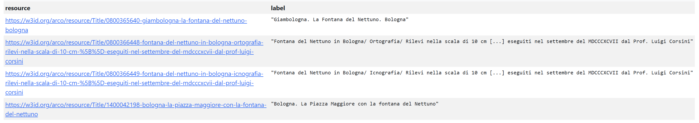
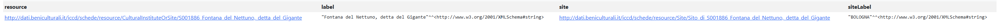
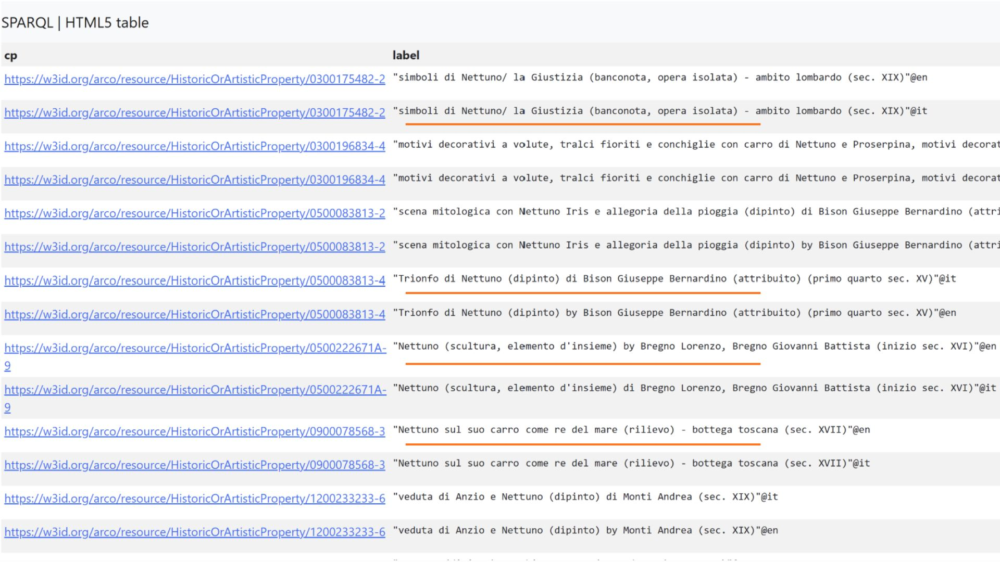

# Fontana del Nettuno

## Enriching Cultural Heritage Knowledge with ArCo and Large Language Models

[View on GitHub](https://github.com/aermosina86-sudo/fontanadelnettuno)

[🏠 Home](index.html) | [🏛️ Topic](topic.html) | [🛠️ Methodology](methodology.html) | [📊 SPARQL & Results](sparql.html) | 🔍 Identifying Gaps | [💬 LLM Prompts](prompts.html) | [🔗 RDF Triples](triples.html) | [⚠️ Challenges](challenges.html) | [✅ Conclusion](conclusion.html)

---

# Identifying Gaps

After exploring the ArCo Knowledge Graph through SPARQL queries, several possible information gaps were identified in the representation of the **Fontana del Nettuno in Bologna**.

The purpose of this section is to explain which information is already present in the dataset and which relationships could be made more explicit through RDF enrichment.

---
## Gap 1 — Location ambiguity and difficulty of identifying the correct resource

The first important gap identified in this project concerns **location ambiguity**. The expression **“Fontana del Nettuno”** is not unique in ArCo, and a search based only on the name of the monument does not automatically identify the correct resource for the **Fontana del Nettuno in Bologna**.

This issue first appeared in **Query 1**, where we searched broadly for resources whose labels contain **“Fontana del Nettuno.”** The query confirmed that ArCo contains resources related to the selected topic. However, the results also showed that there is more than one resource with this expression in its label. These resources do not all represent the same kind of entity. Some refer to cultural sites, while others refer to titles, addresses, units of description, photographs, drawings, or artistic representations.

This means that the name alone is not enough to identify the Bologna monument with certainty.

### Evidence from Query 1

Query 1 showed that ArCo contains several resources whose labels include **“Fontana del Nettuno.”** This was useful as a first exploratory step, but it also revealed that the topic is represented through multiple resources.

```sparql
PREFIX rdfs: <http://www.w3.org/2000/01/rdf-schema#>

SELECT DISTINCT ?resource ?label
WHERE {
  ?resource rdfs:label ?label .
  FILTER(REGEX(STR(?label), "Fontana del Nettuno", "i"))
}
LIMIT 50
```


The results showed that the expression **“Fontana del Nettuno”** appears in several different records. This already suggested that manual filtering and further disambiguation were necessary.

---

### Evidence from Query 2

To focus more specifically on the Bologna case, Query 2 searched for resources whose labels contain both **“Fontana del Nettuno”** and **“Bologna.”**

```sparql
PREFIX rdfs: <http://www.w3.org/2000/01/rdf-schema#>

SELECT DISTINCT ?resource ?label
WHERE {
  ?resource rdfs:label ?label .

  FILTER(REGEX(STR(?label), "Fontana del Nettuno", "i"))
  FILTER(REGEX(STR(?label), "Bologna", "i"))
}
LIMIT 30
```



This query returned several resources related to the **Fontana del Nettuno in Bologna**, but the results were mainly **Title** resources. For example, the query retrieved labels such as:

* **“Giambologna. La Fontana del Nettuno. Bologna”**
* **“Fontana del Nettuno in Bologna / Ortografia”**
* **“Fontana del Nettuno in Bologna / Iconografia”**
* **“Bologna. La Piazza Maggiore con la fontana del Nettuno”**

This shows that even when the word **“Bologna”** is added, the results do not necessarily identify one central monument resource. Instead, they show that the Fontana del Nettuno in Bologna is represented through related titles and documentary records.

---

### Bologna-specific resource identification

To identify the most relevant resource for this project, we then searched for a resource whose label contains **“Fontana del Nettuno”** and whose site is explicitly connected to **BOLOGNA**.

```sparql
PREFIX rdfs: <http://www.w3.org/2000/01/rdf-schema#>
PREFIX cis: <http://dati.beniculturali.it/cis/>

SELECT DISTINCT ?resource ?label ?site ?siteLabel
WHERE {
  ?resource rdfs:label ?label ;
            cis:hasSite ?site .

  ?site rdfs:label ?siteLabel .

  FILTER(REGEX(STR(?label), "Fontana del Nettuno", "i"))
  FILTER(REGEX(STR(?siteLabel), "BOLOGNA", "i"))
}
LIMIT 20
```



This query returned the resource:

```text
http://dati.beniculturali.it/iccd/schede/resource/CulturalInstituteOrSite/S001886_Fontana_del_Nettuno,_detta_del_Gigante
```

with the label:

```text
Fontana del Nettuno, detta del Gigante
```

and the site label:

```text
BOLOGNA
```

This confirms that **“Fontana del Nettuno, detta del Gigante”** is the most appropriate main resource for this project, because it is explicitly connected to Bologna.

---

### Confirmation with ASK query

To confirm that the label **“Fontana del Nettuno”** can also refer to a resource connected to another city, we used an `ASK` query.

The aim of this query was not to study Rome, but to prove that the label **“Fontana del Nettuno”** is ambiguous and can be connected to more than one place.

```sparql
PREFIX rdfs: <http://www.w3.org/2000/01/rdf-schema#>
PREFIX cis: <http://dati.beniculturali.it/cis/>

ASK
WHERE {
  ?resource rdfs:label ?label ;
            cis:hasSite ?site .

  ?site rdfs:label ?siteLabel .

  FILTER(REGEX(STR(?label), "Fontana del Nettuno", "i"))
  FILTER(REGEX(STR(?siteLabel), "ROMA", "i"))
}
```

The query returned:

```text
true
```


The result `true` confirms that ArCo contains at least one resource labelled **“Fontana del Nettuno”** that is connected to **ROMA**. This supports the location ambiguity gap because it shows that the label alone does not automatically identify the Bologna monument.

---

### Interpretation

The gap is not that ArCo lacks information about location. The problem is that location information is necessary to correctly identify the resource. If a user searches only for **“Fontana del Nettuno,”** they may retrieve resources connected to different places or different types of records.

For this project, the correct main resource is:

```text
http://dati.beniculturali.it/iccd/schede/resource/CulturalInstituteOrSite/S001886_Fontana_del_Nettuno,_detta_del_Gigante
```

This resource was selected because it is connected to **BOLOGNA**.

This gap is important for RDF enrichment because the connection between the main resource and its Bologna location should be easy to retrieve and interpret. A clearer location-based representation would reduce ambiguity and help users or automated systems distinguish the **Fontana del Nettuno in Bologna** from other resources with the same or similar name.





