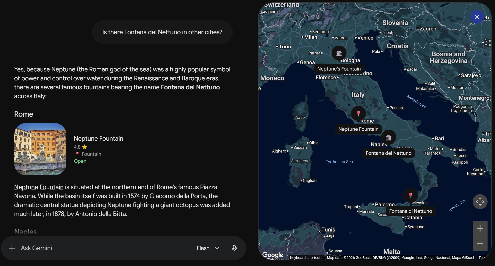
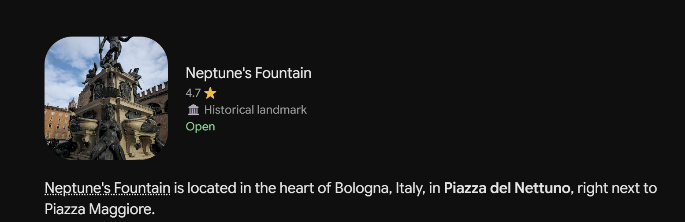
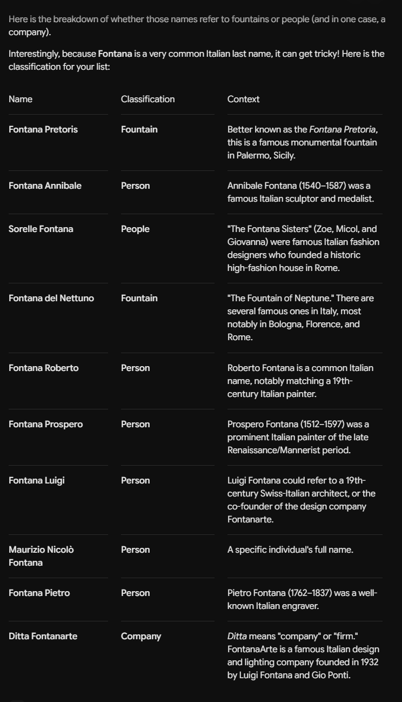
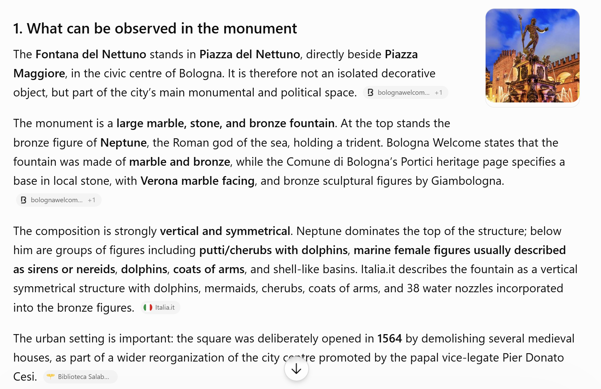
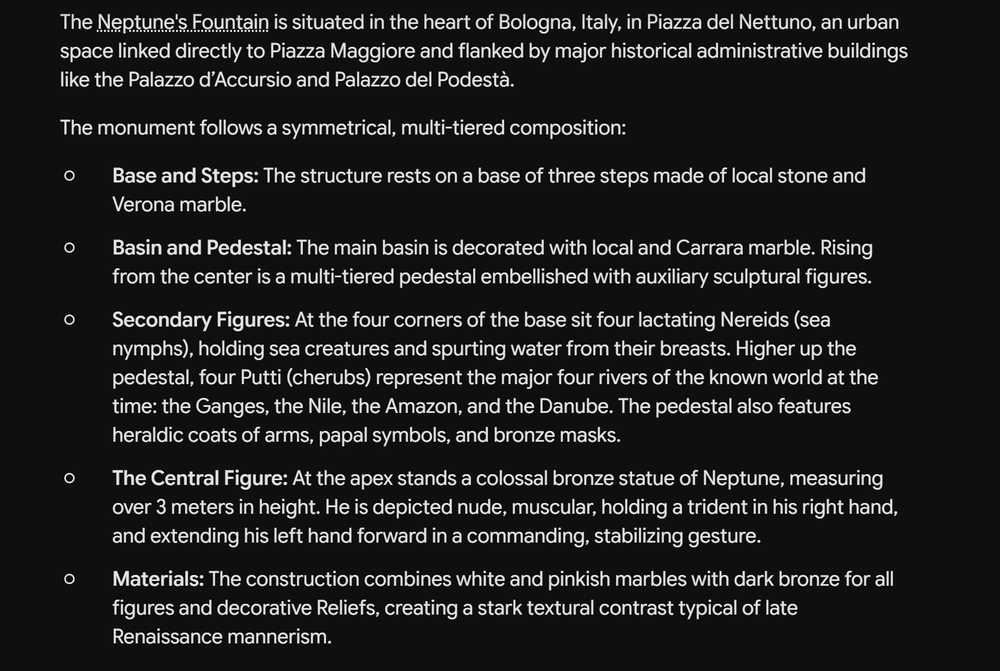

---

## layout: default

# Fontana del Nettuno

## Enriching Cultural Heritage Knowledge with ArCo and Large Language Models

[View on GitHub](https://github.com/aermosina86-sudo/fontanadelnettuno)

[🏠 Home](index.html) | [🏛️ Topic](topic.html) | [🛠️ Methodology](methodology.html) | [📊 SPARQL & Results](sparql.html) | [🔍 Identifying Gaps](gaps.html) | 💬 LLM Prompts | [🔗 RDF Triples](triples.html) | [⚠️ Challenges](challenges.html) | [✅ Conclusion](conclusion.html)

---

# LLM Prompts and Model Comparison

## Aim of the LLM Prompting Phase

The aim of this phase was to test whether Large Language Models can support the enrichment of cultural heritage data about the **Fontana del Nettuno in Bologna**.

The SPARQL exploration showed that ArCo contains several resources related to the fountain, including labels, title resources, image-related records, site information, and subject resources. However, the explored results did not provide a clear cultural description of the monument’s symbolic, artistic, civic, and urban significance.

For this reason, the LLMs were used to generate possible cultural descriptions and to test how well they could deal with ambiguity, disambiguation, classification, and interpretation.

The models tested were:

* **ChatGPT**
* **Gemini**

The comparison focuses on three prompting techniques:

* **Zero-shot prompting**
* **Few-shot prompting**
* **Chain-of-thought prompting**

---

# 1. Zero-shot Prompt: Location Ambiguity

## Prompt

```text
Is there Fontana del Nettuno in other cities?
```

## Explanation of the technique

This is a **zero-shot prompt** because the model was asked a direct question without examples or additional instructions.

The aim was to test whether the model could recognize that **“Fontana del Nettuno”** is not a unique name. This is relevant to the project because the SPARQL queries also showed that the label **“Fontana del Nettuno”** can refer to resources connected to different places.

## ChatGPT Answer


## Gemini Answer



## Comparison

| LLM     | Output Summary                                                                                                                                                  | Strengths                                                                                  | Limitations                                                                    |
| ------- | --------------------------------------------------------------------------------------------------------------------------------------------------------------- | ------------------------------------------------------------------------------------------ | ------------------------------------------------------------------------------ |
| ChatGPT | ChatGPT explained that there are several Neptune fountains in Italy and listed examples such as Bologna, Florence, Rome, and Naples.                            | It directly recognized the ambiguity of the name and gave a clear list of possible cities. | The answer was general and did not focus on ArCo or RDF representation.        |
| Gemini  | Gemini also recognized that there are several Neptune fountains in Italy and visually displayed locations such as Bologna, Rome, Naples, Messina, and Florence. | It was visually useful because it included a map and examples from different cities.       | The answer was more touristic and less focused on the knowledge graph problem. |

## Considerations

Both models correctly recognized that **Fontana del Nettuno** can refer to more than one monument. This supports the gap identified in the SPARQL analysis: the name alone is ambiguous, and location information is necessary to identify the correct resource.

ChatGPT gave a clearer textual explanation, while Gemini provided a more visual answer with map-based information.

---

# 2. Zero-shot Prompt: Identifying the Bologna Fountain

## Prompt

```text
Where is Fontana del Nettuno?
```

## Explanation of the technique

This is also a **zero-shot prompt**. The model was not told that the project focuses on Bologna. The aim was to see which location the model would choose when asked a simple question.

This prompt is useful because it tests whether the model assumes that **Fontana del Nettuno** refers to the Bologna monument.

## ChatGPT Answer


## Gemini Answer



## Comparison

| LLM     | Output Summary                                                                                                       | Strengths                                                                       | Limitations                                                                                             |
| ------- | -------------------------------------------------------------------------------------------------------------------- | ------------------------------------------------------------------------------- | ------------------------------------------------------------------------------------------------------- |
| ChatGPT | ChatGPT answered that the Fontana del Nettuno is located in Bologna, in Piazza del Nettuno, next to Piazza Maggiore. | The answer was clear, precise, and useful for identifying the Bologna monument. | It did not initially emphasize that the name may also refer to other fountains unless asked separately. |
| Gemini  | Gemini also identified the fountain as located in Bologna, in Piazza del Nettuno, next to Piazza Maggiore.           | The answer was concise and visually supported by a place card.                  | Like ChatGPT, it selected one answer without fully explaining the ambiguity of the name.                |

## Considerations

Both models identified the Bologna fountain when asked **“Where is Fontana del Nettuno?”** This shows that the Bologna monument is probably the most commonly associated result for this name.

However, this also confirms the need for human verification. A simple question can lead the model to choose the most famous or most likely answer, while the knowledge graph may contain several resources with similar labels.

---

# 3. Few-shot Prompt: Classifying “Fontana” Results

## Prompt

```text
Identify whether these are names of fountains or names of people. For example:
Fontana Pretoris is a fountain
Fontana Annibale is a name

Sorelle Fontana
Fontana del Nettuno
Fontana Roberto
Fontana Prospero
Fontana Luigi
Maurizio Nicolò Fontana
Fontana Pietro
Ditta Fontanarte
```

## Explanation of the technique

This is a **few-shot prompt** because the model was given examples before the real task.

The examples showed the expected classification:

* one example where **Fontana** refers to a fountain;
* one example where **Fontana** refers to a person’s name.

The purpose was to test whether the model could classify the mixed results found in the SPARQL queries. This is connected to the project because the broad search for **“fontana”** returned both fountain-related resources and resources where **Fontana** was a surname, family name, or company name.

## ChatGPT Answer


## Gemini Answer



## Comparison

| LLM     | Output Summary                                                                                                           | Strengths                                                                       | Limitations                                                                           |
| ------- | ------------------------------------------------------------------------------------------------------------------------ | ------------------------------------------------------------------------------- | ------------------------------------------------------------------------------------- |
| ChatGPT | ChatGPT classified the items into fountain, person, organization, brand, or company.                                     | It followed the task clearly and produced a simple table.                       | Some explanations were brief and did not provide much historical context.             |
| Gemini  | Gemini also classified the results and gave more contextual information about some names, such as artists and companies. | It gave richer explanations and showed why the word “Fontana” can be ambiguous. | Some additional details may require verification before being used in RDF enrichment. |

## Considerations

Both models understood that **Fontana** does not always mean “fountain.” In many cases, it is a surname, a company name, or part of an artist’s name.

This confirms one of the methodological challenges of the project: a broad keyword search using only **“fontana”** is too general. It retrieves mixed results and requires manual filtering.

The few-shot technique was useful because the examples guided the models toward the expected type of classification.

---

# 4. Chain-of-thought Prompt: Cultural Description of the Monument

## Prompt

```text
Analyze the Fontana del Nettuno in Bologna by following these steps:

1. Describe accurately what can be observed in the monument: its location, main sculptural elements, figures, materials, composition, and urban setting.

2. Explain the symbolic meaning of the main elements: Neptune, water, the fountain’s position in the city, the surrounding sculptural figures, and the relationship between the monument and civic power.

3. Interpret the cultural significance of the fountain: what does it represent for Bologna? Why is it considered an important landmark in the city?

4. Place the fountain in its historical and artistic context: when was it created, who was involved in its design and sculptural execution, and what was the political or urban context of Bologna at that time?

5. Summarize the main cultural or art-historical interpretations of the monument: for example, its role as a civic symbol, its connection to Renaissance urban space, and its relationship to the representation of authority.

6. Compare the Fontana del Nettuno briefly with other famous Neptune fountains or monumental fountains in Italy. What makes the Bologna fountain distinctive in terms of style, meaning, location, or urban function?
```

## Explanation of the technique

This is a **chain-of-thought prompt** because the model was asked to follow a sequence of analytical steps.

The purpose was to obtain a richer cultural description of the Fontana del Nettuno. This was necessary because the SPARQL exploration mainly retrieved factual, technical, visual, or documentary information, while a broader cultural interpretation was not clearly available in the explored ArCo results.

## ChatGPT Answer



## Gemini Answer



## Comparison

| LLM     | Output Summary                                                                                                                                                                      | Strengths                                                                                                                                          | Limitations                                                                                                         |
| ------- | ----------------------------------------------------------------------------------------------------------------------------------------------------------------------------------- | -------------------------------------------------------------------------------------------------------------------------------------------------- | ------------------------------------------------------------------------------------------------------------------- |
| ChatGPT | ChatGPT followed the requested structure and discussed location, materials, sculptural elements, symbolism, civic meaning, historical context, and comparison with other fountains. | It was well organized and careful. It often indicated when information needed verification and connected the fountain to Bologna’s civic identity. | The answer was long and would need to be shortened before being used as a Knowledge Graph description.              |
| Gemini  | Gemini also followed the structure and gave a rich interpretation of the monument, focusing on symbolic meaning, civic power, Renaissance urban space, and cultural identity.       | It produced a strong interpretive description and highlighted the fountain’s symbolic and political role.                                          | Some details were stated very confidently and would require verification before being transformed into RDF triples. |

## Considerations

The chain-of-thought prompt produced the most useful results for cultural enrichment.

Both models moved beyond simple factual information and generated interpretive descriptions of the fountain. They described the monument as:

* a central landmark of Bologna;
* a Renaissance or Mannerist monumental fountain;
* a work connected to Giambologna and Tommaso Laureti;
* a symbol of civic and political power;
* an important element of Bologna’s urban identity;
* a monument connected to the organization of public space and water.

ChatGPT was more careful and structured, while Gemini was more interpretive and expressive. However, both answers need human verification before any information can be converted into RDF triples.

---

# Overall Comparison of Prompting Techniques

| Prompt Type                                                | Purpose                                                   | Result                                                                                                        |
| ---------------------------------------------------------- | --------------------------------------------------------- | ------------------------------------------------------------------------------------------------------------- |
| Zero-shot: “Is there Fontana del Nettuno in other cities?” | To test location ambiguity.                               | Both models recognized that there are several Neptune fountains in Italy.                                     |
| Zero-shot: “Where is Fontana del Nettuno?”                 | To test whether the models identify the Bologna fountain. | Both models answered Bologna, showing that the Bologna fountain is strongly associated with this name.        |
| Few-shot classification                                    | To classify mixed “fontana” results from SPARQL.          | Both models correctly distinguished fountains from people, organizations, and companies.                      |
| Chain-of-thought cultural analysis                         | To generate cultural description and interpretation.      | Both models produced useful cultural descriptions, with ChatGPT more structured and Gemini more interpretive. |

---

# General Considerations

The LLM prompting phase showed that ChatGPT and Gemini can be useful tools for cultural heritage enrichment, but their outputs cannot be used automatically.

The zero-shot prompts were useful for identifying ambiguity. They showed that the name **Fontana del Nettuno** can refer to more than one monument, but that the Bologna fountain is often treated as the most likely answer.

The few-shot prompt was useful for classifying ambiguous search results. It helped distinguish cases where **Fontana** referred to a fountain from cases where it referred to a person, family, or company.

The chain-of-thought prompt was the most useful for addressing the main enrichment gap. It generated cultural and interpretive information that was not clearly visible in the explored ArCo results.

However, both models sometimes provided information that would need verification. Therefore, the LLM outputs should be understood as candidate enrichment material, not as final authoritative data.

For the next step of the project, the most useful information from the LLM answers will be selected, checked, and transformed into proposed RDF triples.
