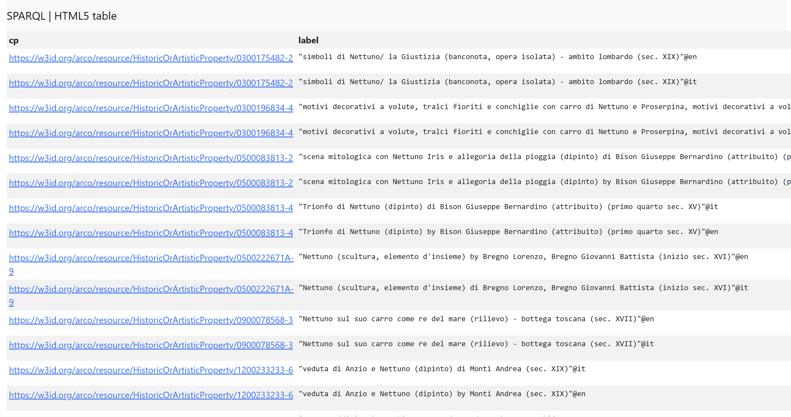
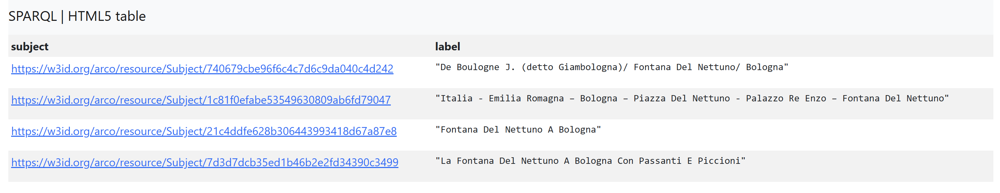
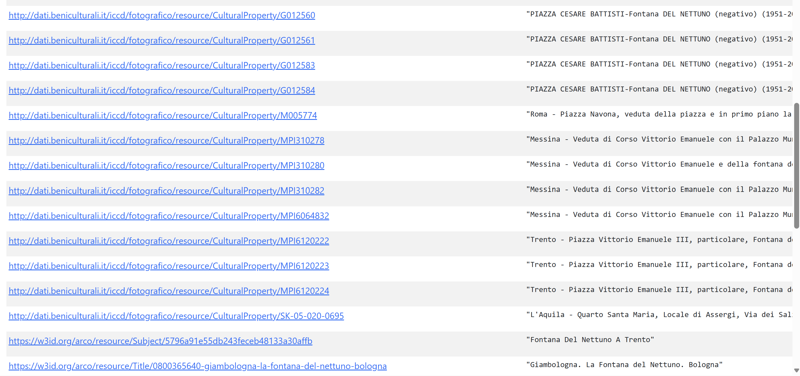

# Fontana del Nettuno

## Enriching Cultural Heritage Knowledge with ArCo and Large Language Models

[View on GitHub](https://github.com/aermosina86-sudo/fontanadelnettuno)

[🏠 Home](index.html) | [🏛️ Topic](topic.html) | [🛠️ Methodology](methodology.html) | 📊 SPARQL & Results | [🔍 Identifying Gaps](gaps.html) | [💬 LLM Prompts](prompts.html) | [🔗 RDF Triples](triples.html) | [⚠️ Challenges](challenges.html) | [✅ Conclusion](conclusion.html)

---

# SPARQL Queries & Results

## Query 1 — Does ArCo contain our topic?

The first step was to verify whether the ArCo Knowledge Graph already contains an entity representing our selected topic, **Fontana del Nettuno**.

Since the exact class of the monument was not known at the beginning, the first query searched broadly through labels instead of limiting the search only to one ArCo class. This allowed us to check whether any resource in ArCo contains the expression **“Fontana del Nettuno”** in its label.

### Explanation of keywords used

**DISTINCT**: eliminates duplicate results.

**FILTER** and **REGEX**: used to retrieve more specific information. `FILTER` restricts the results based on a condition, while `REGEX` searches for a textual pattern inside string values.

**resource**: this variable stands for any resource in the knowledge graph. It is used instead of `cp` because, at this exploratory stage, we do not yet know whether the Fontana del Nettuno is classified as a Cultural Property, a monument, an artistic object, or another type of ArCo resource.

### SPARQL Query

```sparql
PREFIX rdfs: <http://www.w3.org/2000/01/rdf-schema#>

SELECT DISTINCT ?resource ?label
WHERE {
  ?resource rdfs:label ?label .
  FILTER(REGEX(STR(?label), "Fontana del Nettuno", "i"))
}
LIMIT 50
```

### Results

The query returned several resources whose labels contain the expression **“Fontana del Nettuno.”** This confirms that ArCo contains resources related to the selected topic.




### Interpretation of the Results

The results show that ArCo contains more than one resource related to **Fontana del Nettuno**. However, these resources do not all represent the same kind of entity. Some refer to the cultural site itself, while others refer to titles, addresses, units of description, photographs, drawings, or artistic representations of the fountain.

## Query 2 — Finding image-related resources about the Fontana del Nettuno

In this query, the aim was to find different kinds of visual resources related to the **Fontana del Nettuno in Bologna**. Instead of looking only for direct `foaf:depiction` links, the query searches more broadly for image-related records, including photographs, postcards, prints, drawings, negatives, and other visual representations.

This was useful because visual resources in ArCo and ICCD are not always stored only through the `foaf:depiction` property. Sometimes the image-related nature of the resource appears directly in the label, for example through words such as *stampa*, *cartolina*, *positivo*, or *negativo*.

### Explanation of keywords used

**UNION**: combines two search strategies: one for ArCo historic/artistic properties and one for photographic records.

**FILTER** and **REGEX**: search for resources whose labels contain “Fontana,” “Nettuno,” and “Bologna.”

**OPTIONAL**: retrieves the type and depiction only if this information is available.

**DISTINCT**: removes duplicate results.

**LIMIT**: limits the number of results to 50.

### SPARQL Query

```sparql
PREFIX rdf: <http://www.w3.org/1999/02/22-rdf-syntax-ns#>
PREFIX rdfs: <http://www.w3.org/2000/01/rdf-schema#>
PREFIX arco: <https://w3id.org/arco/ontology/arco/>
PREFIX a-cd: <https://w3id.org/arco/ontology/context-description/>
PREFIX foaf: <http://xmlns.com/foaf/0.1/>

SELECT DISTINCT ?image ?label ?type ?depiction
WHERE {
  {
    ?image a arco:HistoricOrArtisticProperty ;
           rdfs:label ?label .
  }
  UNION
  {
    ?image rdfs:label ?label .
    FILTER(REGEX(STR(?image), "fotografico", "i"))
  }

  FILTER(REGEX(STR(?label), "Fontana", "i"))
  FILTER(REGEX(STR(?label), "Nettuno", "i"))
  FILTER(REGEX(STR(?label), "Bologna", "i"))

  OPTIONAL { ?image rdf:type ?type . }
  OPTIONAL { ?image foaf:depiction ?depiction . }
}
LIMIT 50
```
### Results

The query returned several image-related resources connected to the Fontana del Nettuno in Bologna. The results include postcards, prints, photographic positives, negatives, and views of the fountain in its urban context.

### Images

The following screenshots show examples of image-related resources retrieved by the query.
<div style="display: flex; gap: 15px; align-items: flex-start; flex-wrap: wrap;">

  

  

  

</div>

### Interpretation of the Results

The results show that ArCo and ICCD contain many visual records connected to the Fontana del Nettuno in Bologna. These resources do not all represent the fountain in the same way. Some are postcards, some are photographs, some are negatives, and others are prints or views of the surrounding urban space.

This shows that the Fontana del Nettuno is represented not only as a single cultural site, but also through a wider network of visual resources. However, not every result contains a direct `foaf:depiction` link, which suggests that image-related information exists in the dataset but is not always represented in a simple or uniform way.

## Query 3 — Identifying subjects related to the Fontana del Nettuno

This query was designed to find unique resources that are classified as **Subjects** in the ArCo ontology and whose labels include the words **“Fontana”** and **“Nettuno.”**

By doing this, we aimed to discover whether ArCo contains subject resources related to the Fontana del Nettuno. This is useful because subjects can reveal how the monument is semantically described or referenced in the knowledge graph.

### Explanation of keywords used

**a-cd:Subject**: searches for resources classified as subjects in the ArCo context-description ontology.

**rdfs:label**: retrieves the name or label of each subject.

**FILTER** and **REGEX**: restrict the results to labels containing “Fontana” and “Nettuno.”

**DISTINCT**: removes duplicate results.

### SPARQL Query

```sparql
PREFIX a-cd: <https://w3id.org/arco/ontology/context-description/>
PREFIX rdfs: <http://www.w3.org/2000/01/rdf-schema#>

SELECT DISTINCT ?subject ?label
WHERE {
  ?subject a a-cd:Subject ;
           rdfs:label ?label .

  FILTER(REGEX(STR(?label), "Fontana", "i"))
  FILTER(REGEX(STR(?label), "Nettuno", "i"))
}
LIMIT 50
```

### Results

The query returned four subject resources related to the Fontana del Nettuno. Some of them refer directly to the fountain in Bologna, while others connect the fountain to people, places, or visual representations.



### Subjects Found

1. [De Boulogne J. (detto Giambologna)/ Fontana Del Nettuno/ Bologna](https://w3id.org/arco/resource/Subject/740679cbe96f6c4c7d6c9da040c4d242)

2. [Italia - Emilia Romagna - Bologna - Piazza Del Nettuno - Palazzo Re Enzo - Fontana Del Nettuno](https://w3id.org/arco/resource/Subject/1c81f0efabe53549630809ab6fd79047)

3. [Fontana Del Nettuno A Bologna](https://w3id.org/arco/resource/Subject/21c4ddfe628b306443993418d67a87e8)

4. [La Fontana Del Nettuno A Bologna Con Passanti E Piccioni](https://w3id.org/arco/resource/Subject/7d3d7dcb35ed1b46b2e2fd34390c3499)

### Interpretation of the Results

The results show that ArCo does contain subject resources related to the Fontana del Nettuno. This means that the fountain is not only present through cultural property records and image-related resources, but also appears as a subject in the knowledge graph.

However, the subject labels are not completely uniform. Some labels refer directly to the fountain, while others include additional contextual information, such as Bologna, Piazza del Nettuno, Palazzo Re Enzo, Giambologna, or specific visual scenes. This suggests that the topic is represented in ArCo, but its subject representation is distributed across several differently named resources.

## Query 4 — Using UNION to retrieve multiple naming patterns

In this query, we explored whether the **Fontana del Nettuno** appears in ArCo through different naming patterns. In particular, we wanted to compare the standard name **“Fontana del Nettuno”** with the alternative expression **“Gigante”**, which is sometimes associated with the fountain.

The aim of the query was to retrieve resources that contain either one of these naming patterns. This helps us understand whether the monument is represented through different labels, alternative names, or related records in the dataset.

### Explanation of keywords used

**UNION**: combines two alternative search patterns. In this query, it allows us to retrieve resources whose labels contain either “Fontana del Nettuno” or “Gigante.”

**FILTER** and **REGEX**: search for specific words inside the labels.

**DISTINCT**: removes duplicate results.

**LIMIT**: limits the number of results to 50.

### SPARQL Query

```sparql
PREFIX rdfs: <http://www.w3.org/2000/01/rdf-schema#>

SELECT DISTINCT ?resource ?label
WHERE {
  {
    ?resource rdfs:label ?label .
    FILTER(REGEX(?label, "Fontana del Nettuno", "i"))
  }
  UNION
  {
    ?resource rdfs:label ?label .
    FILTER(REGEX(?label, "Gigante", "i"))
  }
}
LIMIT 50
```

### Results

The query returned several resources that match either the standard name **“Fontana del Nettuno”** or the alternative naming pattern connected to **“Gigante.”**


### Examples of IRIs Found

1. [Fontana del Nettuno, detta del Gigante](http://dati.beniculturali.it/iccd/schede/resource/CulturalInstituteOrSite/S001886_Fontana_del_Nettuno,_detta_del_Gigante)
   Label: “Fontana del Nettuno, detta del Gigante”

2. [Fontana del Nettuno](http://dati.beniculturali.it/iccd/schede/resource/CulturalInstituteOrSite/S015658_Fontana_del_Nettuno)
   Label: “Fontana del Nettuno”

3. [Unit of description: Fontana del Nettuno, detta del Gigante](http://dati.beniculturali.it/iccd/schede/resource/uod/S001886)
   Label: “Fontana del Nettuno, detta del Gigante”

4. [Unit of description: Fontana del Nettuno](http://dati.beniculturali.it/iccd/schede/resource/uod/S015658)
   Label: “Fontana del Nettuno”

5. [Address resource for Fontana del Nettuno, detta del Gigante](http://dati.beniculturali.it/iccd/schede/resource/Address/Indirizzo_della_sede_di_S001886_Fontana_del_Nettuno,_detta_del_Gigante)
   Label: “Indirizzo della Sede di Fontana del Nettuno, detta del Gigante”

6. [Bologna. La Piazza Maggiore con la fontana del Nettuno](https://w3id.org/arco/resource/Title/1400042198-bologna-la-piazza-maggiore-con-la-fontana-del-nettuno)
   Label: “Bologna. La Piazza Maggiore con la fontana del Nettuno”

7. [Giambologna. La Fontana del Nettuno. Bologna](https://w3id.org/arco/resource/Title/0800365640-giambologna-la-fontana-del-nettuno-bologna)
   Label: “Giambologna. La Fontana del Nettuno. Bologna”

### Interpretation of the Results

The results show that ArCo contains resources using different naming patterns related to the Fontana del Nettuno. Some resources use the simple label **“Fontana del Nettuno,”** while others use the longer expression **“Fontana del Nettuno, detta del Gigante.”**

This is important because it suggests that the same monument, or closely related resources, may appear in the dataset under different names. The query therefore helps us identify possible alternative denominations and related records.

At the same time, the results also show that the expression **“Fontana del Nettuno”** is not unique in the dataset. The query retrieved resources related to fountains in other Italian cities, such as Trento, Florence, and Rome. It also retrieved different types of resources, including cultural sites, units of description, addresses, photographic records, titles, and historic or artistic properties.

For this reason, the query required manual filtering. The most relevant results for this project are the resources connected to Bologna, especially the resources labelled **“Fontana del Nettuno”** and **“Fontana del Nettuno, detta del Gigante.”**

This query is useful for the project because it shows that the representation of the Fontana del Nettuno is distributed across several labels and resource types. It also suggests a possible information gap: the relationship between the standard name **“Fontana del Nettuno”** and the alternative denomination **“detta del Gigante”** could be made more explicit in RDF.

