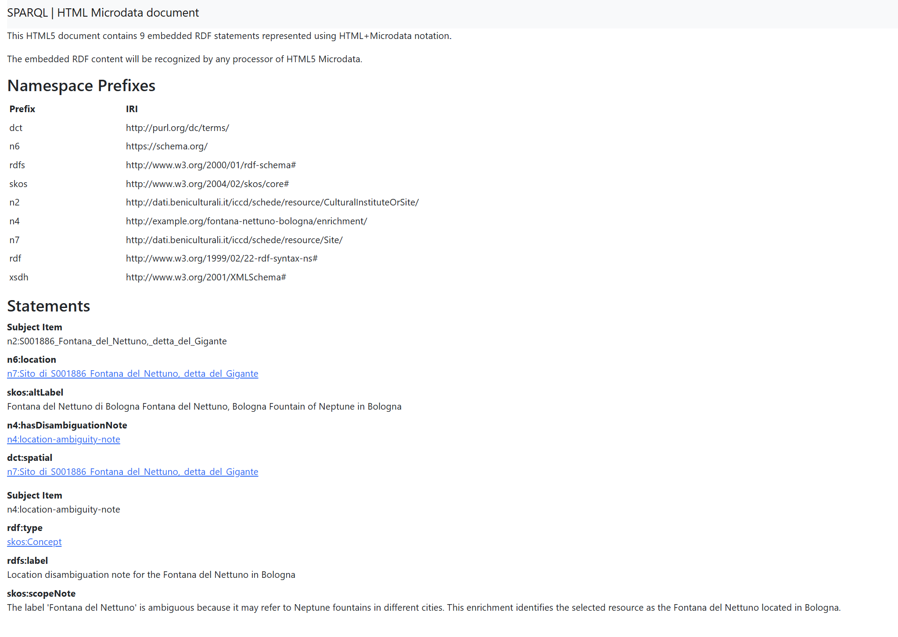
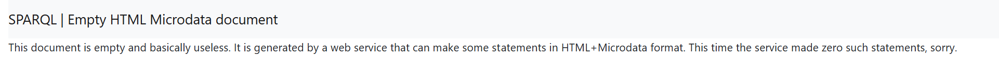
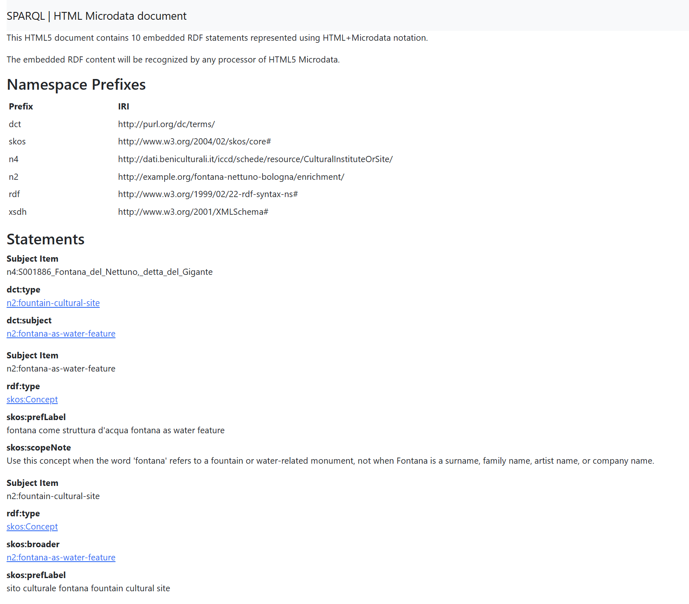
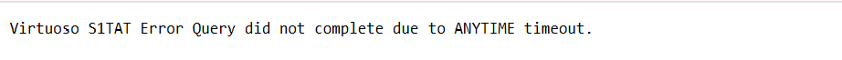
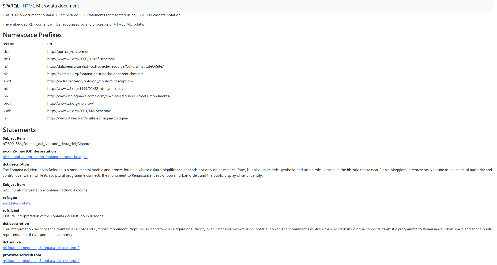
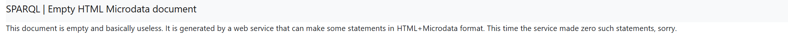

# Fontana del Nettuno

## Enriching Cultural Heritage Knowledge with ArCo and Large Language Models

[View on GitHub](https://github.com/aermosina86-sudo/fontanadelnettuno)

[🏠 Home](index.html) | [🏛️ Topic](topic.html) | [🛠️ Methodology](methodology.html) | [📊 SPARQL & Results](sparql.html) | [🔍 Identifying Gaps](gaps.html) | [💬 LLM Prompts](prompts.html) | 🔗 RDF Triples | [⚠️ Challenges](challenges.html) | [✅ Conclusion](conclusion.html)

---

# Generating New RDF Triples

## Aim of this section

After identifying the main information gaps in the ArCo representation of the **Fontana del Nettuno in Bologna**, we asked Large Language Models to help us generate possible RDF triples.

The aim was not to modify ArCo directly. Instead, the aim was to create **candidate enrichment triples** showing how the missing or unclear information could be represented in RDF.

The three gaps addressed in this section are:

1. **Location ambiguity**: the label **“Fontana del Nettuno”** can refer to fountains in different cities.
2. **Keyword ambiguity**: the word **“fontana”** can refer to a fountain, but also to a surname, artist name, family name, or company name.
3. **Missing cultural description**: the explored ArCo resources contain factual and documentary information, but not a clear cultural interpretation of the monument’s symbolic, civic, and urban meaning.

Both **ChatGPT** and **Gemini** were asked to propose RDF triples and SPARQL `CONSTRUCT` queries. Their answers were then tested in the SPARQL endpoint.

The results were different:

* the **ChatGPT-based CONSTRUCT queries worked** and generated RDF statements;
* the **Gemini-based CONSTRUCT queries were more ambitious**, but some returned empty results or caused a timeout.

For this reason, both outputs are documented below, but the final evaluation gives priority to the triples that worked correctly in the SPARQL endpoint.

---

# Prompt used for RDF triple generation

The following prompt was given to both ChatGPT and Gemini.

```text
I am working on a Knowledge Graph enrichment project about the Fontana del Nettuno in Bologna using the ArCo Knowledge Graph.

My project identified three information gaps:

1. Location ambiguity:
The label “Fontana del Nettuno” is not unique. It can refer to fountains in different cities. The resource selected for my project is the Fontana del Nettuno in Bologna.

Main resource:
http://dati.beniculturali.it/iccd/schede/resource/CulturalInstituteOrSite/S001886_Fontana_del_Nettuno,_detta_del_Gigante

Site resource:
http://dati.beniculturali.it/iccd/schede/resource/Site/Sito_di_S001886_Fontana_del_Nettuno,_detta_del_Gigante

Site label:
BOLOGNA

2. Keyword ambiguity:
A broad SPARQL search for “fontana” returned mixed results. Some results referred to actual fountains, while others referred to people, artists, families, or companies named Fontana.

3. Missing cultural description:
The explored ArCo resources contain factual and documentary data, such as labels, site information, titles, and image-related records. However, they do not clearly provide a cultural description of the Fontana del Nettuno’s symbolic, civic, artistic, and urban significance.

Please propose RDF triples in Turtle syntax for these three gaps.

Requirements:
1. Separate confirmed information from proposed enrichment.
2. Use ArCo or standard RDF vocabularies where possible.
3. Use valid Turtle syntax.
4. Do not invent unsupported facts.
5. Clearly explain each triple.
6. Also create SPARQL CONSTRUCT queries for the proposed triples.
```

---

# 1. Triple set for Gap 1: Location Ambiguity

## Missing information

The first gap concerns **location ambiguity**.

The expression **“Fontana del Nettuno”** is not unique. It can refer to Neptune fountains in several Italian cities, such as Bologna, Florence, Rome, Naples, or Messina.

In this project, the selected ArCo resource is:

```text
http://dati.beniculturali.it/iccd/schede/resource/CulturalInstituteOrSite/S001886_Fontana_del_Nettuno,_detta_del_Gigante
```

The SPARQL exploration showed that this resource is connected to a site resource labelled **BOLOGNA**. However, because the same name can refer to different fountains, the Bologna location should be made clearer.

---

## ChatGPT triples for Gap 1

ChatGPT proposed adding alternative labels and a disambiguation note. This approach is cautious because it does not invent a new location. It only makes the already identified Bologna location easier to understand.

```turtle
@prefix rdfs:    <http://www.w3.org/2000/01/rdf-schema#> .
@prefix skos:    <http://www.w3.org/2004/02/skos/core#> .
@prefix dcterms: <http://purl.org/dc/terms/> .
@prefix schema:  <https://schema.org/> .
@prefix ex:      <http://example.org/fontana-nettuno-bologna/enrichment/> .

<http://dati.beniculturali.it/iccd/schede/resource/CulturalInstituteOrSite/S001886_Fontana_del_Nettuno,_detta_del_Gigante>
    skos:altLabel "Fontana del Nettuno di Bologna"@it ;
    skos:altLabel "Fontana del Nettuno, Bologna"@it ;
    skos:altLabel "Fountain of Neptune in Bologna"@en ;
    dcterms:spatial <http://dati.beniculturali.it/iccd/schede/resource/Site/Sito_di_S001886_Fontana_del_Nettuno,_detta_del_Gigante> ;
    schema:location <http://dati.beniculturali.it/iccd/schede/resource/Site/Sito_di_S001886_Fontana_del_Nettuno,_detta_del_Gigante> ;
    ex:hasDisambiguationNote ex:location-ambiguity-note .

ex:location-ambiguity-note
    a skos:Concept ;
    rdfs:label "Location disambiguation note for the Fontana del Nettuno in Bologna"@en ;
    skos:scopeNote "The label 'Fontana del Nettuno' is ambiguous because it may refer to Neptune fountains in different cities. This enrichment identifies the selected resource as the Fontana del Nettuno located in Bologna."@en .
```

### Explanation

The `skos:altLabel` triples add alternative labels that include **Bologna**.

The `dcterms:spatial` and `schema:location` triples connect the main resource to the Bologna site resource.

The local property `ex:hasDisambiguationNote` connects the resource to a note explaining why the disambiguation is needed.

---

## ChatGPT CONSTRUCT query for Gap 1

```sparql
PREFIX rdfs:    <http://www.w3.org/2000/01/rdf-schema#>
PREFIX skos:    <http://www.w3.org/2004/02/skos/core#>
PREFIX dcterms: <http://purl.org/dc/terms/>
PREFIX schema:  <https://schema.org/>
PREFIX ex:      <http://example.org/fontana-nettuno-bologna/enrichment/>

CONSTRUCT {
  <http://dati.beniculturali.it/iccd/schede/resource/CulturalInstituteOrSite/S001886_Fontana_del_Nettuno,_detta_del_Gigante>
      skos:altLabel "Fontana del Nettuno di Bologna"@it ;
      skos:altLabel "Fontana del Nettuno, Bologna"@it ;
      skos:altLabel "Fountain of Neptune in Bologna"@en ;
      dcterms:spatial <http://dati.beniculturali.it/iccd/schede/resource/Site/Sito_di_S001886_Fontana_del_Nettuno,_detta_del_Gigante> ;
      schema:location <http://dati.beniculturali.it/iccd/schede/resource/Site/Sito_di_S001886_Fontana_del_Nettuno,_detta_del_Gigante> ;
      ex:hasDisambiguationNote ex:location-ambiguity-note .

  ex:location-ambiguity-note
      a skos:Concept ;
      rdfs:label "Location disambiguation note for the Fontana del Nettuno in Bologna"@en ;
      skos:scopeNote "The label 'Fontana del Nettuno' is ambiguous because it may refer to Neptune fountains in different cities. This enrichment identifies the selected resource as the Fontana del Nettuno located in Bologna."@en .
}
WHERE {
  <http://dati.beniculturali.it/iccd/schede/resource/CulturalInstituteOrSite/S001886_Fontana_del_Nettuno,_detta_del_Gigante>
      ?p ?o .
}
LIMIT 1
```

### ChatGPT result



This query generated **9 RDF statements**, so it was successfully executed in the SPARQL endpoint.

---

## Gemini triples for Gap 1

Gemini proposed a more ambitious solution. It suggested linking the site to a standard city entity and linking the ArCo resource to external authority files.

```turtle
@prefix rdf: <http://www.w3.org/1999/02/22-rdf-syntax-ns#> .
@prefix rdfs: <http://www.w3.org/2000/01/rdf-schema#> .
@prefix owl: <http://www.w3.org/2002/07/owl#> .
@prefix clv: <https://w3id.org/italia/onto/CLV/> .
@prefix arco-core: <https://w3id.org/arco/ontology/core/> .
@prefix arco-location: <https://w3id.org/arco/ontology/location/> .
@prefix wd: <http://www.wikidata.org/entity/> .
@prefix ex-site: <http://dati.beniculturali.it/iccd/schede/resource/Site/> .
@prefix ex-cul: <http://dati.beniculturali.it/iccd/schede/resource/CulturalInstituteOrSite/> .

ex-cul:S001886_Fontana_del_Nettuno,_detta_del_Gigante
    a arco-core:CulturalInstituteOrSite ;
    rdfs:label "Fontana del Nettuno, detta del Gigante"@it ;
    arco-location:hasSite ex-site:Sito_di_S001886_Fontana_del_Nettuno,_detta_del_Gigante .

ex-site:Sito_di_S001886_Fontana_del_Nettuno,_detta_del_Gigante
    a clv:Site ;
    rdfs:label "BOLOGNA"@it ;
    clv:hasCity wd:Q10143 .

ex-cul:S001886_Fontana_del_Nettuno,_detta_del_Gigante
    owl:sameAs wd:Q1418858 ,
               <http://dbpedia.org/resource/Fountain_of_Neptune,_Bologna> .
```

### Explanation

Gemini’s proposal is semantically rich because it links the resource to external authority files such as Wikidata and DBpedia. This could help global disambiguation.

However, this proposal requires additional verification. In particular, the `owl:sameAs` relation is strong because it states that two resources identify the same entity. For this reason, it should not be used unless the equivalence has been carefully checked.

---

## Gemini CONSTRUCT query for Gap 1

```sparql
PREFIX rdfs: <http://www.w3.org/2000/01/rdf-schema#>
PREFIX owl: <http://www.w3.org/2002/07/owl#>
PREFIX clv: <https://w3id.org/italia/onto/CLV/>
PREFIX arco-location: <https://w3id.org/arco/ontology/location/>
PREFIX wd: <http://www.wikidata.org/entity/>

CONSTRUCT {
  ?site clv:hasCity wd:Q10143 .
  ?culturalResource owl:sameAs wd:Q1418858 .
}
WHERE {
  ?culturalResource rdfs:label "Fontana del Nettuno, detta del Gigante"@it ;
                    arco-location:hasSite ?site .
  ?site rdfs:label "BOLOGNA"@it .
}
```

### Gemini result



This query did not work successfully in the endpoint. The result was empty.

One possible reason is that the site relation found during our SPARQL exploration was `cis:hasSite`, while Gemini used `arco-location:hasSite`. Another reason is that the query depends on an exact label with a language tag, which may not match the stored literal exactly.

---

# 2. Triple set for Gap 2: Keyword Ambiguity

## Missing information

The second gap concerns the ambiguity of the word **“fontana.”**

A broad SPARQL search for **“fontana”** returned mixed results. Some referred to actual fountains, while others referred to people, artists, families, or companies named **Fontana**.

Examples included:

* **Fontana del Nettuno**
* **Sorelle Fontana**
* **Fontana Roberto**
* **Fontana Prospero**
* **Fontana Luigi**
* **Maurizio Nicolò Fontana**
* **Fontana Pietro**
* **Ditta Fontanarte**

This showed that the keyword **“fontana”** is not precise by itself.

---

## ChatGPT triples for Gap 2

ChatGPT proposed creating a small project-level SKOS concept to distinguish **fontana as a water feature** from **Fontana as a proper name**.

```turtle
@prefix skos:    <http://www.w3.org/2004/02/skos/core#> .
@prefix dcterms: <http://purl.org/dc/terms/> .
@prefix ex:      <http://example.org/fontana-nettuno-bologna/enrichment/> .

<http://dati.beniculturali.it/iccd/schede/resource/CulturalInstituteOrSite/S001886_Fontana_del_Nettuno,_detta_del_Gigante>
    dcterms:subject ex:fontana-as-water-feature ;
    dcterms:type ex:fountain-cultural-site .

ex:fontana-as-water-feature
    a skos:Concept ;
    skos:prefLabel "fontana as water feature"@en ;
    skos:prefLabel "fontana come struttura d'acqua"@it ;
    skos:scopeNote "Use this concept when the word 'fontana' refers to a fountain or water-related monument, not when Fontana is a surname, family name, artist name, or company name."@en .

ex:fountain-cultural-site
    a skos:Concept ;
    skos:prefLabel "fountain cultural site"@en ;
    skos:prefLabel "sito culturale fontana"@it ;
    skos:broader ex:fontana-as-water-feature .
```

### Explanation

This is a methodological enrichment. It does not add a new historical fact about the monument. Instead, it records the ambiguity observed during the SPARQL exploration.

The concept `ex:fontana-as-water-feature` explains that in this project **fontana** refers to a fountain or water-related monument, not to a person or company named Fontana.

---

## ChatGPT CONSTRUCT query for Gap 2

```sparql
PREFIX skos:    <http://www.w3.org/2004/02/skos/core#>
PREFIX dcterms: <http://purl.org/dc/terms/>
PREFIX ex:      <http://example.org/fontana-nettuno-bologna/enrichment/>

CONSTRUCT {
  <http://dati.beniculturali.it/iccd/schede/resource/CulturalInstituteOrSite/S001886_Fontana_del_Nettuno,_detta_del_Gigante>
      dcterms:subject ex:fontana-as-water-feature ;
      dcterms:type ex:fountain-cultural-site .

  ex:fontana-as-water-feature
      a skos:Concept ;
      skos:prefLabel "fontana as water feature"@en ;
      skos:prefLabel "fontana come struttura d'acqua"@it ;
      skos:scopeNote "Use this concept when the word 'fontana' refers to a fountain or water-related monument, not when Fontana is a surname, family name, artist name, or company name."@en .

  ex:fountain-cultural-site
      a skos:Concept ;
      skos:prefLabel "fountain cultural site"@en ;
      skos:prefLabel "sito culturale fontana"@it ;
      skos:broader ex:fontana-as-water-feature .
}
WHERE {
  <http://dati.beniculturali.it/iccd/schede/resource/CulturalInstituteOrSite/S001886_Fontana_del_Nettuno,_detta_del_Gigante>
      ?p ?o .
}
LIMIT 1
```

### ChatGPT result



This query generated **10 RDF statements**, so it worked successfully.

---

## Gemini triples for Gap 2

Gemini proposed a different solution based on explicit semantic typing. It suggested distinguishing fountains from people or organizations by assigning different external classes.

```turtle
@prefix dbo: <http://dbpedia.org/ontology/> .
@prefix wd: <http://www.wikidata.org/entity/> .
@prefix ex-agent: <http://dati.beniculturali.it/iccd/schede/resource/Agent/> .
@prefix ex-cul: <http://dati.beniculturali.it/iccd/schede/resource/CulturalInstituteOrSite/> .

ex-cul:S001886_Fontana_del_Nettuno,_detta_del_Gigante
    a dbo:Fountain ,
      wd:Q483453 .

ex-agent:Sorelle_Fontana
    a dbo:FashionDesigner ,
      wd:Q43229 .

ex-agent:Fontana_Prospero
    a dbo:Artist ,
      wd:Q5733 .
```

### Explanation

Gemini’s proposal is useful because it directly addresses the ambiguity between **fontana as a fountain** and **Fontana as a proper name**.

However, it also introduces new or assumed IRIs for agents such as `ex-agent:Sorelle_Fontana` and `ex-agent:Fontana_Prospero`. These IRIs were not verified in our ArCo exploration, so this version is less safe for the final triples.

---

## Gemini CONSTRUCT query for Gap 2

```sparql
PREFIX rdfs: <http://www.w3.org/2000/01/rdf-schema#>
PREFIX dbo: <http://dbpedia.org/ontology/>
PREFIX wd: <http://www.wikidata.org/entity/>

CONSTRUCT {
  ?fountainResource a dbo:Fountain, wd:Q483453 .
}
WHERE {
  ?fountainResource rdfs:label ?label .
  FILTER(CONTAINS(LCASE(?label), "fontana del nettuno"))
  FILTER(CONTAINS(STR(?fountainResource), "CulturalInstituteOrSite"))
}
```

### Gemini result



This query did not work successfully. One attempt produced a timeout error.


---

# 3. Triple set for Gap 3: Missing Cultural Description

## Missing information

The third gap concerns the absence of a clear cultural description.

The SPARQL exploration showed that ArCo contains factual and documentary information about the Fontana del Nettuno, such as labels, site information, title resources, image-related records, and subject resources.

However, the explored resources did not clearly provide a cultural explanation of the fountain’s symbolic, civic, artistic, and urban significance.

For this reason, the LLMs were used to generate candidate cultural descriptions. These descriptions were then manually shortened and checked before being converted into RDF triples.

---

## ChatGPT triples for Gap 3

ChatGPT proposed adding a cultural description and connecting the resource to a separate interpretation node.

```turtle
@prefix rdfs:    <http://www.w3.org/2000/01/rdf-schema#> .
@prefix dcterms: <http://purl.org/dc/terms/> .
@prefix prov:    <http://www.w3.org/ns/prov#> .
@prefix a-cd:    <https://w3id.org/arco/ontology/context-description/> .
@prefix ex:      <http://example.org/fontana-nettuno-bologna/enrichment/> .

<http://dati.beniculturali.it/iccd/schede/resource/CulturalInstituteOrSite/S001886_Fontana_del_Nettuno,_detta_del_Gigante>
    dcterms:description "The Fontana del Nettuno in Bologna is a monumental marble and bronze fountain whose cultural significance depends not only on its material form, but also on its civic, symbolic, and urban role. Located in the historic centre near Piazza Maggiore, it represents Neptune as an image of authority and control over water, while its sculptural programme connects the monument to Renaissance ideas of power, urban order, and the public display of civic identity."@en ;
    a-cd:isSubjectOfInterpretation ex:cultural-interpretation-fontana-nettuno-bologna .

ex:cultural-interpretation-fontana-nettuno-bologna
    a a-cd:Interpretation ;
    rdfs:label "Cultural interpretation of the Fontana del Nettuno in Bologna"@en ;
    a-cd:hasInterpretationSubject <http://dati.beniculturali.it/iccd/schede/resource/CulturalInstituteOrSite/S001886_Fontana_del_Nettuno,_detta_del_Gigante> ;
    dcterms:description "This interpretation describes the fountain as a civic and symbolic monument. Neptune is understood as a figure of authority over water and, by extension, political power. The monument's central urban position in Bologna connects its artistic programme to Renaissance urban space and to the public representation of civic and papal authority."@en ;
    dcterms:source <https://www.bolognawelcome.com/en/places/squares-streets-monuments/fontana-del-nettuno-2> ;
    dcterms:source <https://www.italia.it/en/emilia-romagna/bologna/fountain-neptune> ;
    prov:wasDerivedFrom <https://www.bolognawelcome.com/en/places/squares-streets-monuments/fontana-del-nettuno-2> ;
    prov:wasDerivedFrom <https://www.italia.it/en/emilia-romagna/bologna/fountain-neptune> .
```

### Explanation

The `dcterms:description` triple adds a cultural description to the main resource.

The `a-cd:isSubjectOfInterpretation` triple links the fountain to a separate interpretation node.

The interpretation node is typed as `a-cd:Interpretation`. It includes a short explanation of the fountain’s civic and symbolic meaning.

The `dcterms:source` and `prov:wasDerivedFrom` triples make the enrichment transparent because they show that the interpretation is based on external sources and human verification.

---

## ChatGPT CONSTRUCT query for Gap 3

```sparql
PREFIX rdfs:    <http://www.w3.org/2000/01/rdf-schema#>
PREFIX dcterms: <http://purl.org/dc/terms/>
PREFIX prov:    <http://www.w3.org/ns/prov#>
PREFIX a-cd:    <https://w3id.org/arco/ontology/context-description/>
PREFIX ex:      <http://example.org/fontana-nettuno-bologna/enrichment/>

CONSTRUCT {
  <http://dati.beniculturali.it/iccd/schede/resource/CulturalInstituteOrSite/S001886_Fontana_del_Nettuno,_detta_del_Gigante>
      dcterms:description "The Fontana del Nettuno in Bologna is a monumental marble and bronze fountain whose cultural significance depends not only on its material form, but also on its civic, symbolic, and urban role. Located in the historic centre near Piazza Maggiore, it represents Neptune as an image of authority and control over water, while its sculptural programme connects the monument to Renaissance ideas of power, urban order, and the public display of civic identity."@en ;
      a-cd:isSubjectOfInterpretation ex:cultural-interpretation-fontana-nettuno-bologna .

  ex:cultural-interpretation-fontana-nettuno-bologna
      a a-cd:Interpretation ;
      rdfs:label "Cultural interpretation of the Fontana del Nettuno in Bologna"@en ;
      a-cd:hasInterpretationSubject <http://dati.beniculturali.it/iccd/schede/resource/CulturalInstituteOrSite/S001886_Fontana_del_Nettuno,_detta_del_Gigante> ;
      dcterms:description "This interpretation describes the fountain as a civic and symbolic monument. Neptune is understood as a figure of authority over water and, by extension, political power. The monument's central urban position in Bologna connects its artistic programme to Renaissance urban space and to the public representation of civic and papal authority."@en ;
      dcterms:source <https://www.bolognawelcome.com/en/places/squares-streets-monuments/fontana-del-nettuno-2> ;
      dcterms:source <https://www.italia.it/en/emilia-romagna/bologna/fountain-neptune> ;
      prov:wasDerivedFrom <https://www.bolognawelcome.com/en/places/squares-streets-monuments/fontana-del-nettuno-2> ;
      prov:wasDerivedFrom <https://www.italia.it/en/emilia-romagna/bologna/fountain-neptune> .
}
WHERE {
  <http://dati.beniculturali.it/iccd/schede/resource/CulturalInstituteOrSite/S001886_Fontana_del_Nettuno,_detta_del_Gigante>
      ?p ?o .
}
LIMIT 1
```

### ChatGPT result



This query generated **10 RDF statements**, so it worked successfully.

---

## Gemini triples for Gap 3

Gemini proposed using SKOS annotation properties to add cultural interpretation directly to the main resource.

```turtle
@prefix skos: <http://www.w3.org/2004/02/skos/core#> .
@prefix ex-cul: <http://dati.beniculturali.it/iccd/schede/resource/CulturalInstituteOrSite/> .

ex-cul:S001886_Fontana_del_Nettuno,_detta_del_Gigante
    skos:scopeNote "Symbol of papal power and governance, commissioned by Cardinal Legate Charles Borromeo to celebrate the election of Pope Pius IV."@en ;
    skos:historyNote "Functions as a visual and physical anchor of the civic center, intentionally positioning the power of the church adjacent to Palazzo d'Accursio."@en ;
    skos:editorialNote "A premier example of Italian Mannerist sculpture, showcasing Giambologna's dynamic, multi-viewpoint composition (figura serpentinata)."@en .
```

### Explanation

Gemini’s proposal was useful because it directly addressed the missing cultural-description gap. It added symbolic, historical, and artistic notes.

However, some of the statements were too specific and would require additional verification before being used. For example, claims about exact patronage or interpretation should not be inserted into RDF unless supported by a reliable source.

For this reason, the final project used the more cautious ChatGPT-style model with a separate interpretation node and source information.

---

## Gemini CONSTRUCT query for Gap 3

```sparql
PREFIX rdfs: <http://www.w3.org/2000/01/rdf-schema#>
PREFIX skos: <http://www.w3.org/2004/02/skos/core#>

CONSTRUCT {
  ?res skos:scopeNote "Symbol of papal power and governance, commissioned by Cardinal Legate Charles Borromeo to celebrate the election of Pope Pius IV."@en ;
       skos:historyNote "Functions as a visual and physical anchor of the civic center, intentionally positioning the power of the church adjacent to Palazzo d'Accursio."@en ;
       skos:editorialNote "A premier example of Italian Mannerist sculpture, showcasing Giambologna's dynamic, multi-viewpoint composition (figura serpentinata)."@en .
}
WHERE {
  ?res rdfs:label "Fontana del Nettuno, detta del Gigante"@it .
}
```

### Gemini result



This query did not work successfully. It returned an empty HTML Microdata document.

One reason is that it used exact label matching with a language tag. If the label in the endpoint is stored as a plain string or in a slightly different form, the query does not match anything.

---

# Comparison of ChatGPT and Gemini RDF outputs

| Aspect            | ChatGPT                                     | Gemini                                                     |
| ----------------- | ------------------------------------------- | ---------------------------------------------------------- |
| General approach  | Cautious and controlled                     | Ambitious and broader                                      |
| RDF triples       | Simpler, closer to the project evidence     | Richer, but sometimes introduced unverified external links |
| CONSTRUCT queries | Used the selected IRI directly              | Often used exact labels or broader searches                |
| Endpoint result   | Queries worked and generated RDF statements | Some queries returned empty results or timeout             |
| Main strength     | Practical and easier to test                | Useful for generating enrichment ideas                     |
| Main limitation   | Less semantically ambitious                 | Required more correction and verification                  |


---

# Interpretation of the comparison

The comparison shows that both LLMs were useful, but in different ways.

ChatGPT was more useful for producing **working RDF triples and CONSTRUCT queries**. Its approach was simpler and more practical because it used the selected Fontana del Nettuno resource directly.

Gemini was useful for generating ideas about possible semantic enrichment, such as external authority links, stronger classification, and cultural annotation. However, its proposed queries did not work reliably in the SPARQL endpoint.

This confirms an important methodological point of the project: LLMs can help generate RDF structures, but their outputs must always be checked by humans and tested in the SPARQL endpoint.

---

# Triples Summary

| Gap                  | Model   | Subject                           | Predicate                        | Object                                    |
| -------------------- | ------- | --------------------------------- | -------------------------------- | ----------------------------------------- |
| Location ambiguity   | ChatGPT | Fontana del Nettuno main resource | `skos:altLabel`                  | “Fontana del Nettuno di Bologna”          |
| Location ambiguity   | ChatGPT | Fontana del Nettuno main resource | `dcterms:spatial`                | Bologna site resource                     |
| Location ambiguity   | ChatGPT | Fontana del Nettuno main resource | `schema:location`                | Bologna site resource                     |
| Location ambiguity   | ChatGPT | Fontana del Nettuno main resource | `ex:hasDisambiguationNote`       | Location ambiguity note                   |
| Location ambiguity   | Gemini  | Fontana del Nettuno main resource | `owl:sameAs`                     | Wikidata / DBpedia resources              |
| Keyword ambiguity    | ChatGPT | Fontana del Nettuno main resource | `dcterms:subject`                | `ex:fontana-as-water-feature`             |
| Keyword ambiguity    | ChatGPT | Fontana del Nettuno main resource | `dcterms:type`                   | `ex:fountain-cultural-site`               |
| Keyword ambiguity    | ChatGPT | `ex:fontana-as-water-feature`     | `skos:scopeNote`                 | Explanation of “fontana” as water feature |
| Keyword ambiguity    | Gemini  | Fontana del Nettuno main resource | `rdf:type`                       | `dbo:Fountain`, `wd:Q483453`              |
| Keyword ambiguity    | Gemini  | Fontana-related names             | `rdf:type`                       | Person, artist, organization classes      |
| Cultural description | ChatGPT | Fontana del Nettuno main resource | `dcterms:description`            | Cultural description                      |
| Cultural description | ChatGPT | Fontana del Nettuno main resource | `a-cd:isSubjectOfInterpretation` | Cultural interpretation node              |
| Cultural description | ChatGPT | Cultural interpretation node      | `dcterms:source`                 | Bologna Welcome and Italia.it             |
| Cultural description | Gemini  | Fontana del Nettuno main resource | `skos:scopeNote`                 | Cultural and symbolic note                |
| Cultural description | Gemini  | Fontana del Nettuno main resource | `skos:historyNote`               | Urban and historical note                 |
| Cultural description | Gemini  | Fontana del Nettuno main resource | `skos:editorialNote`             | Artistic interpretation note              |

---

# Final consideration

The proposed RDF triples show how the representation of the **Fontana del Nettuno in Bologna** could be enriched.
# LLM outputs

## ChatGPT result

ChatGPT proposed a cautious RDF model. It separated confirmed information from proposed enrichment and used the selected Fontana del Nettuno resource directly. Its `CONSTRUCT` queries were simpler and easier to test. The ChatGPT-based triples were more practical because their `CONSTRUCT` queries worked successfully in the SPARQL endpoint. They were therefore used as the main final enrichment proposal.

## Gemini result

Gemini proposed a more ambitious model. It suggested stronger semantic typing, external authority links such as Wikidata and DBpedia, and more interpretive annotation properties. These ideas were useful, but some queries were harder to verify and did not work reliably in the endpoint. The Gemini-based triples were useful as alternative ideas. They suggested external authority links, stronger classification, and richer cultural annotation. However, they were not adopted directly because their `CONSTRUCT` queries either returned empty results or caused a timeout, and some claims required further verification.

This confirms the central point of the project: LLMs can support Knowledge Graph enrichment, but their outputs must be tested, corrected, and evaluated by humans before being used as RDF enrichment.
